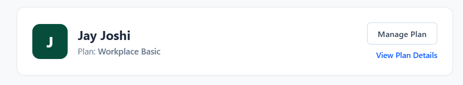
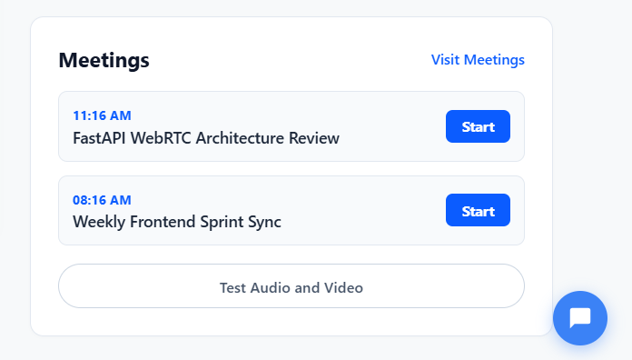

# Zoom Workplace Clone

A premium, full-stack video conferencing web application modeled after the official **Zoom Workplace Web App**. It features a modern, pixel-perfect dashboard, interactive video meeting rooms, real-time peer-to-peer WebRTC video/audio communication, instant messaging, screen sharing, and advanced host tools.

---

## 📸 Interface Preview

### 1. Zoom Workplace Dashboard
Displays user plan details, editable display name with dynamic initials, quick meeting launcher, and upcoming vs. recent meetings lists.


### 2. Zoom Meeting Room & Interactive Tools
Live peer-to-peer WebRTC video streams, interactive whiteboard, live chat with permissions, participant controls, reactions, and AI Companion.


---

## ✨ Features

### 🖥️ 1. Zoom Workplace Dashboard
- **Top Utility & Search Bar**: Integrated Search link, Zoom Support, and Contact Sales hotlines.
- **Header Utility**: Circular avatar that displays the current user's initials dynamically.
- **In-place Name Editor**: Clicking the display name opens an inline input field. The customized username is saved to `localStorage` and automatically updates the square profile initials, header initials, and host identifiers across meetings.
- **Upcoming vs. Recent Meetings**: The meetings panel fetches and splits scheduled meetings ("Upcoming" with a **Start** button) and completed meetings ("Recent" with a **Rejoin** button) from a persistent database.

### 🎥 2. Interactive Zoom Meeting Room
- **Multi-Peer WebRTC Communication**: Secure, direct mesh peer-to-peer audio and video streaming using WebRTC.
- **Camera Visibility Preservation**: Custom view toggling that resolves stream loss bugs when camera feed is hidden/unhidden.
- **Animated Media Fallback**: Generates dynamic HTML5 canvas video streams if a physical camera is not connected or permission is denied, ensuring a robust user experience.
- **Live Chat Sidebar**: Full chat interface displaying sender names, formatting rules, user role locks, and a send button that lights up dynamically as you type.
- **Simulate Participants (SDE Bot Helper)**: Spawn mock websocket-synced participants on the fly to test host controls single-handedly without opening additional tabs.
- **Security & Host Controls**: Allows the host to lock meetings, toggle participant permissions (chat, rename, screenshare), and mute or kick users.
- **Mermaid & Sub-menus**:
  - **Shared Whiteboard**: Draw collaboratively on a shared canvas over the video stage.
  - **Breakout Rooms**: Set up room numbers and assignment rules in a modal configuration interface.
  - **Reactions & Feedbacks**: Floating reactions (👏, 👍, 😂, etc.) and quick state inputs (Yes, No, Go Slower, Raise Hand).
  - **AI Companion**: Side panel with sparkles animation that provides simulated meeting summaries on request.

---

## 🛠️ Tech Stack

- **Frontend**: Next.js 15 (TypeScript, Vanilla CSS Modules)
- **Backend**: Python 3.12 + FastAPI (WebSockets signaling & REST APIs)
- **Database**: SQLite (SQLAlchemy ORM)
- **Real-Time Communication**: WebSockets (signaling & chat) + WebRTC Peer-to-Peer (media streams)

---

## ⚙️ Local Development Setup

### 1. Prerequisites
- **Node.js** (v18.0.0 or higher)
- **Python** (v3.9 or higher)
- **Google Chrome / Mozilla Firefox** (for testing WebRTC components)

---

### 2. Backend Installation (FastAPI)

1. Open a terminal and navigate to the `backend` folder:
   ```bash
   cd backend
   ```
2. Create and activate a Python virtual environment:
   ```bash
   # Windows PowerShell:
   python -m venv venv
   .\venv\Scripts\Activate.ps1

   # macOS/Linux:
   python3 -m venv venv
   source venv/bin/activate
   ```
3. Install dependencies:
   ```bash
   pip install -r requirements.txt
   ```
4. Start the FastAPI development server:
   ```bash
   uvicorn main:app --reload --port 8000
   ```
   *Note: On first startup, the SQLite database `zoom_clone.db` is automatically generated and seeded with upcoming and recent meetings.*

---

### 3. Frontend Installation (Next.js)

1. Open a new terminal and navigate to the `frontend` folder:
   ```bash
   cd frontend
   ```
2. Install npm dependencies:
   ```bash
   npm install
   ```
3. Run the Next.js development server:
   ```bash
   npm run dev
   ```
4. Visit the web app in your browser at `http://localhost:3000`.

---

## 🌐 Deployment Guidelines

For deploying the production stack:

### 1. Backend Deployment (e.g., Render, Heroku, or AWS EC2)
- Configure your deployment platform to run the startup command:
  ```bash
  uvicorn main:app --host 0.0.0.0 --port $PORT
  ```
- Set up persistent storage if you want to keep the SQLite database file (`zoom_clone.db`), or configure PostgreSQL/MySQL by changing the `DATABASE_URL` environment variable.

### 2. Frontend Deployment (e.g., Vercel, Netlify, or Amplify)
- Set Next.js environment variables to direct API requests to your deployed backend URL.
- Build command: `npm run build`
- Output directory: `.next`

---

## 🗄️ Database Schema Design

SQLite relational model manages the application state:

### `meetings` Table
Stores the scheduled/instant meetings metadata.
- `id` (VARCHAR, PK) - Formatted Zoom ID (e.g. `982-371-294`).
- `title` (VARCHAR) - Topic of the meeting.
- `description` (VARCHAR, Nullable) - Agenda details.
- `meeting_type` (VARCHAR) - `instant` or `scheduled`.
- `start_time` (DATETIME, Nullable) - Time of the scheduled meeting.
- `duration` (INTEGER, Nullable) - Length in minutes.
- `created_at` (DATETIME) - Creation timestamp.
- `host_name` (VARCHAR) - Host username.
- `is_active` (BOOLEAN) - Status flag.

### `participant_history` Table
Tracks participants joining/leaving meetings for the dashboard's "Recent Meetings" list.
- `id` (INTEGER, PK, Autoincrement)
- `meeting_id` (VARCHAR, FK to `meetings.id`)
- `display_name` (VARCHAR) - Joined participant's display name.
- `joined_at` (DATETIME)
- `left_at` (DATETIME, Nullable)
